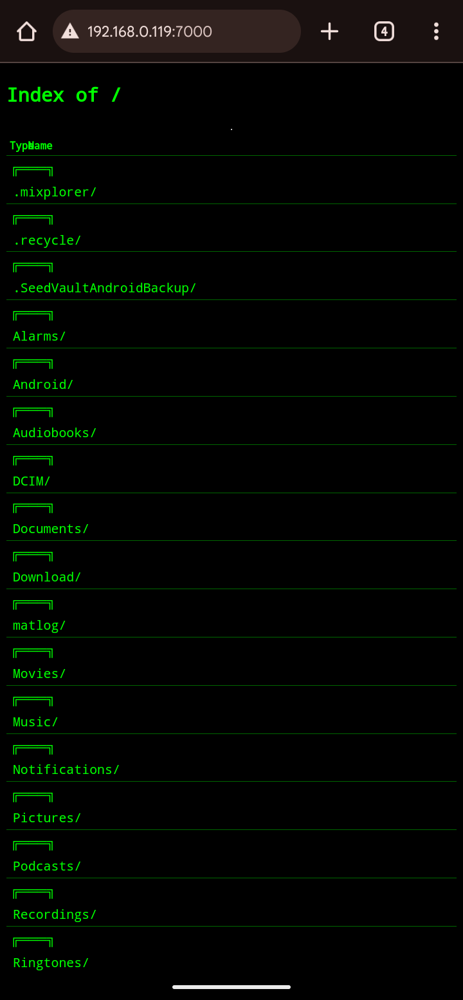
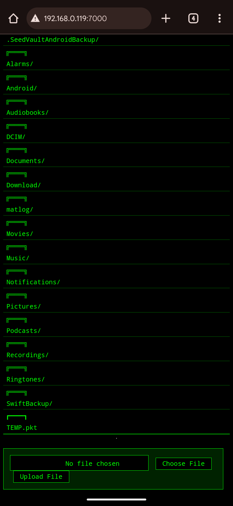

# Hacker-styled-FTP  

It is based on python's `http.server`. Custom CSS added to give it hacker look.It is web-based and hopefully works on any browser.  
## Usage
1-Use python `<filename>`(On server)  
2-Follow the instructions  
3-Search `<server-ip>:<port>` in browser to access FTP(On client)  
## Preview  
  

